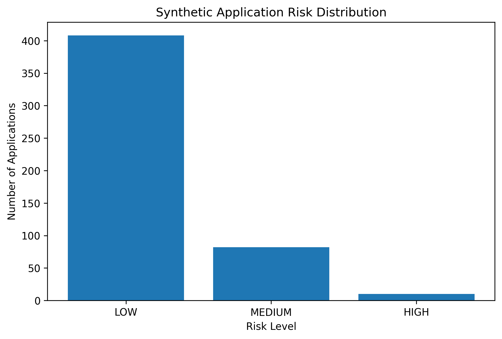
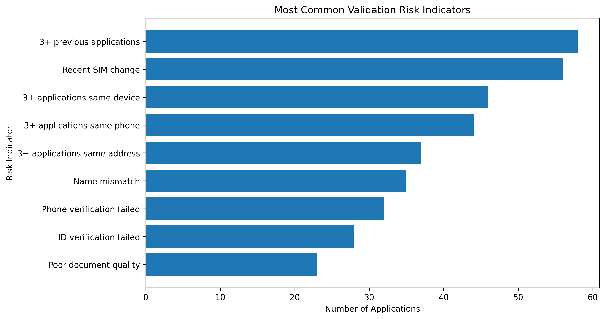

# Validation Dashboard

## Overview

This dashboard presents a visual analysis of a synthetic fintech application dataset designed to demonstrate validation support, fraud prevention, and risk-monitoring skills.

The analysis focuses on identifying patterns that may require additional verification or manual investigation while recognising that risk indicators do not automatically mean fraud.

**Important:** This is an independent portfolio project using entirely fictional data. The risk indicators, scoring methodology, thresholds, and recommendations are proposed for demonstration purposes and do not represent PayJoy's internal policies, systems, or fraud-detection rules.

## Dashboard Objectives

The dashboard was created to:

* Monitor the distribution of application risk levels
* Identify common validation risk indicators
* Support prioritisation of applications for manual review
* Demonstrate data-driven decision-making
* Highlight the importance of investigating multiple indicators rather than relying on a single signal
* Consider customer experience and false-positive risk alongside fraud prevention

## Visual 1: Application Risk Distribution

This chart shows the number of synthetic applications classified as LOW, MEDIUM, or HIGH risk using the proposed scoring methodology.

The purpose is to demonstrate how a validation team could monitor the overall risk profile of incoming applications and identify whether additional investigation capacity may be required.

## Visual 2: Common Validation Risk Indicators

This chart identifies the most frequently occurring validation indicators in the synthetic dataset.

Examples include:

* Identity verification failures
* Name mismatches
* Phone verification failures
* Poor document quality
* Multiple applications
* Multiple applications linked to the same device
* Multiple applications linked to the same phone number
* Multiple applications linked to the same address
* Recent SIM changes

These indicators should be treated as signals for investigation rather than automatic evidence of fraudulent activity.

## How the Dashboard Supports Validation Work

A validation support process could use this type of analysis to:

1. Identify applications requiring additional verification.
2. Prioritise cases with multiple risk indicators.
3. Investigate whether unusual patterns have legitimate explanations.
4. Identify potential false positives.
5. Escalate possible system or tool issues.
6. Monitor recurring patterns that may require process improvements.
7. Balance fraud prevention with a smooth customer experience.

## Data Source

The dashboard uses the synthetic dataset generated for this portfolio project.

Dataset size: **500 fictional applications**

No real customer information was used.

## Key Principle

> Effective validation is not simply about rejecting more applications. It is about identifying genuine risk while reducing unnecessary customer friction and protecting customer information.

## Related Portfolio Sections

* `01_identity_validation` — Synthetic application data and proposed risk-scoring model
* `02_fraud_investigations` — Fictional investigation cases and decision reasoning
* `04_customer_support` — Customer-service scenarios related to validation and disputes
* `05_privacy_popia` — Privacy-by-design considerations and POPIA principles
* `06_payjoy_sa_case_study` — Independent case-study proposal based on publicly available information

